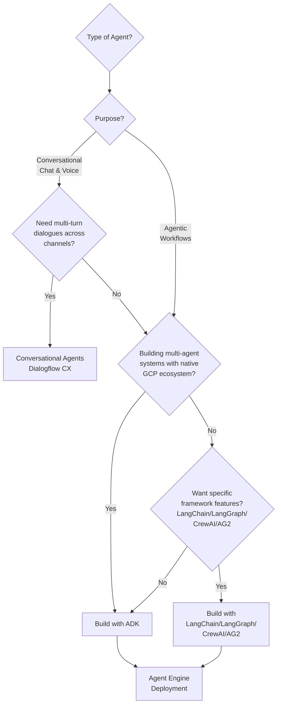

# Building AI Agents in Google Cloud: Choose the Right Approach for Your Needs

## TL;DR

- **ADK** → Google-developed open-source framework for building complex multi-agent systems with maximum control and modularity
- **Conversational Agents (Dialogflow CX)** → Omnichannel customer conversations with structured flows and open-ended playbooks
- **Open-Source Frameworks** → Leverage specific framework capabilities (LangChain's integrations, LangGraph's state management, CrewAI's collaboration) on GCP's managed infrastructure
- **Agentspace** → Enterprise search platform and self-serve agent creation for automating everyday knowledge work tasks 

**Key decision point:** Choose your building framework (ADK/Conversational Agents/Open-Source), then optionally deploy to Agentspace for enterprise wide access.
---

Building AI agents in Google Cloud Platform presents four distinct paths, each optimized for different use cases. The challenge isn't finding options—it's choosing the right one.

This guide cuts through the complexity to help you make the right decision based on your specific business needs, not technical preferences.

## Decision Framework

*Note: Agents deployed via Agent Engine and Conversational Agents can be integrated into Agentspace for organization-wide access

## Four Approaches to Building AI Agents in GCP

### 1. Agent Development Kit (ADK) - For Complex Multi-Agent Orchestration

**Best for:** Multi-agent workflows requiring complex routing and orchestration with programmatic control

ADK is Google's open-source framework for building sophisticated multi-agent systems with complete programmatic control.

**When to choose ADK:**
- You need sophisticated multi-agent orchestration with hierarchical delegation
- You need to orchestrate complex integrations with conditional logic and custom error handling across enterprise systems
- Your use case involves backend automation or event-driven workflows (scheduled jobs, API-triggered processes, continuous monitoring) without user-initiated conversations

**Why ADK excels at this:**
- Native GCP integration with built-in tools for BigQuery, AlloyDB, Cloud SQL, and direct access to Vertex AI services
- Multimodal capabilities with documents, audio, and video, plus bidirectional streaming for real-time voice interactions
- Modular architecture for independent agent development
- 100+ enterprise connectors via Application Integration Toolset
- Built-in evaluation framework (web UI, pytest, CLI) with CI/CD pipeline integration, step-by-step debugging with trace inspection, and comprehensive audit logging

**Not the right fit when:**
- A simpler solution suffices - if you need a basic RAG bot or simple workflow, ADK may be overkill

**Example Business use cases where ADK excels:**
- **Financial reporting** - Multi-source data aggregation, validation, and quarterly report generation triggered by schedule or events
- **Insurance claim processing** - End-to-end claim automation with document extraction, policy validation, fraud detection, and intelligent routing
- **Mortgage underwriting** - Document extraction agent, income verification agent, credit risk agent, and compliance agent coordinate with dynamic routing based on loan type, applicant profile, and regulatory requirements
- **Incident response** - Real-time log analysis with root cause identification, automated rollbacks, and post-mortem generation

### 2. Conversational Agents (Dialogflow CX) - For Multi-turn conversation

**Best for:** Interactive user conversations requiring multi-turn dialogues across multiple channels chat, voice etc 

Conversational Agents (Dialogflow CX) combines structured **flows** and open-ended **playbooks** for building customer service experiences across all channels.

**When to choose Conversational Agents:**
- Your use case involves **conversational interactions with users** (customer support, sales, ordering, troubleshooting, IT helpdesk, etc.)
- Users initiate conversations and expect natural, multi-turn dialogues
- You need to serve conversations across multiple touchpoints (web chat, mobile app, phone/voice, contact centers)
- Your conversations require both structured flows (predictable paths like order status checks) AND open-ended dialogues (general questions using knowledge bases)

**Why Conversational Agents excels at this:**
- Flows (structured) and playbooks (open-ended) conversation patterns
- Native omnichannel deployment with 30+ language support
- Visual flow builders for non-technical users
- Deep contact center integration

**Not the right fit when:**
- Primary task is not conversational - better tools exist for backend automation or data processing
- No multi-turn conversation flows - simpler solutions may suffice for one-off Q&A

**Business use cases where Conversational Agents excel:**
- **Customer support** - Multi-turn conversations for order status, returns, and product questions across web, mobile, and phone
- **Voice IVR** - Natural language phone interactions for account management with 30+ language support and telephony integration
- **Restaurant ordering** - Conversational order-taking with menu navigation, customization, and payment collection
- **Technical support** - Guided troubleshooting with state-managed diagnostic workflows and human handoff capabilities

### 3. Open-Source Frameworks on Vertex AI - For Framework-Specific Capabilities

**Best for:** Teams wanting specific framework features (LangChain's integrations, LangGraph's state management, CrewAI's collaboration, AG2's multi-agent patterns, LlamaIndex's RAG pipelines) on GCP's managed infrastructure

Vertex AI Agent Engine deploys your existing open-source framework code (LangChain, LangGraph, CrewAI, AG2, LlamaIndex) with managed infrastructure and deep GCP integrations.

**When to choose this path:**
- You need specific framework capabilities (LangChain's 700+ integrations, LangGraph's state machines, CrewAI's role-based collaboration, AG2's multi-agent debates, LlamaIndex's advanced RAG)
- You've already invested in framework codebases and want to deploy to production without rebuilding
- You want rapid prototyping with framework-specific features (vector stores, document loaders, APIs, state management patterns)
- You need GCP's managed infrastructure without abandoning framework expertise

**Why this excels:**
- Leverage open-source framework capabilities on GCP's enterprise-grade managed infrastructure
- Managed infrastructure with autoscaling
- Enterprise-grade security and compliance built-in
- Direct access to GCP services (BigQuery, Cloud SQL, etc.)
- Dedicated SDK support for major frameworks
- Access to Vertex AI Gen AI Evaluation service for agent performance assessment and trajectory analysis

**Not the right fit when:**
- You don't need framework-specific features - ADK or Conversational Agents provide simpler, more streamlined solutions for GCP

**Business scenarios where you should use open-source frameworks:**
- **RAG support bot** - Existing LangChain/LlamaIndex Q&A system with custom retrieval ready for production scaling
- **Document analysis** - LlamaIndex investment with custom indices and query pipelines for contract analysis
- **Research assistant** - LangGraph application with complex state management and human-in-the-loop workflows

### 4. Google Agentspace - Enterprise Search & Agent Platform 

**Best for:** Organizations needing enterprise-wide search across data sources and self-serve agent creation for everyday knowledge work tasks

Agentspace provides enterprise search across 100+ data sources and serves as a central hub for organizational agents. Enterprise Plus edition includes Agent Designer for creating no-code agents that automate everyday knowledge work.

**Key capabilities:**
- Unified enterprise search across 100+ data sources (Microsoft SharePoint, Confluence, ServiceNow, Google Drive, etc.)
- Self-serve Agent Designer for creating agents that automate everyday tasks (emails, scheduling, admin work) - Enterprise Plus edition
- Central deployment hub ("From your company") for organizational agents from ADK, Dialogflow CX, and partner sources
- Three editions: Enterprise, Enterprise Plus (includes Agent Designer), and Frontline

**When to choose Agentspace:**
- You need enterprise-wide access to search and agents that respect individual user permissions and data access controls
- Users want to automate simple day-to-day tasks (scheduling, emails, admin coordination) with permission-aware agents (requires Enterprise Plus for Agent Designer)
- You need a central hub for deploying organizational agents from ADK (via Agent Engine), Dialogflow CX, and partner sources across the enterprise

**Not the right fit when:**
- Your agents serve external customers rather than internal employees - Use Conversational Agents or ADK with direct deployment
- You need complex orchestration or advanced agent capabilities - Build with ADK, Dialogflow CX, or open-source frameworks first (can deploy to Agentspace later)
- You don't need enterprise-wide agent discovery or user-permission-aware search - Deploy agents directly via Agent Engine or Dialogflow CX
- Budget constraints with per-seat licensing model - Pay-per-use options (ADK, Vertex AI Agent Engine) may be more economical

## Side-by-Side Comparison

| Aspect | ADK (Google's Open-Source) | Open-Source Frameworks | Conversational Agents | Agentspace |
|--------|-----|------------------------|----------------------|------------|
| **Best For** | Build multi-agent systems | Build multi-agent systems | Interactive user conversations | Permission-aware enterprise search & agents |
| **Development Approach** | Code-first  | Code-first  | Visual flow builder + Natural Language | Agent Designer (Enterprise Plus) |
| **Key Strength** | Native GCP integration + multimodal | Based on Framework | Omnichannel support | User-permission-aware access |
| **Hosting Platform** | Vertex AI Agent Engine | Vertex AI Agent Engine | Google-managed service | Google-managed service |

## Summary

Building AI agents in GCP comes down to choosing the right tool for your specific needs: ADK for multi-agent orchestration with native GCP integration, Conversational Agents for interactive dialogues across channels, Community Frameworks for leveraging specific framework capabilities, or Agentspace for enterprise-wide permission-aware search and agents.

All four approaches are production-ready and can work together—many organizations use multiple approaches for different use cases. Start with your use case, validate with a proof-of-concept, and focus on business value over technical complexity.

