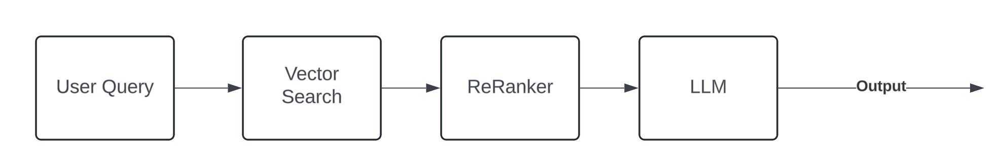
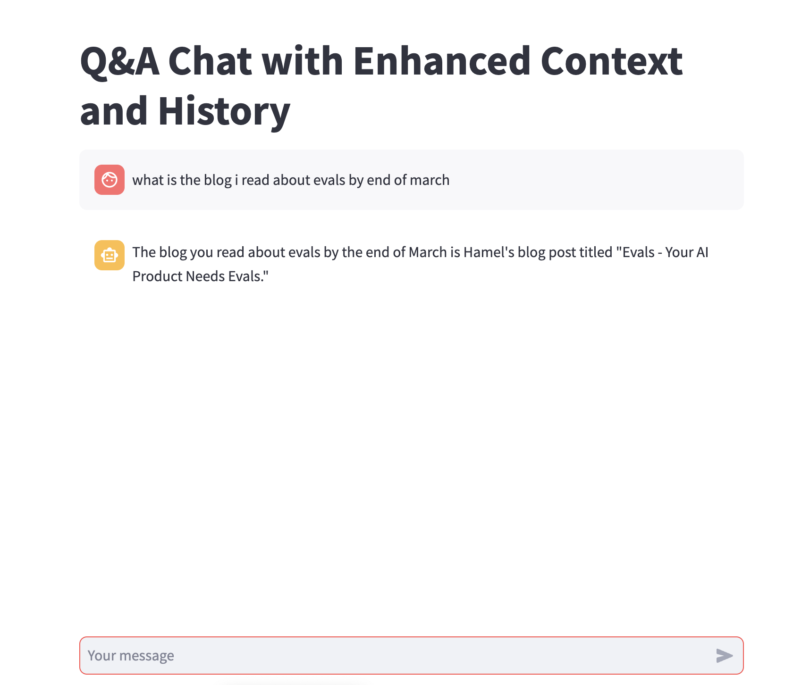

# Building an Obsidian Knowledge base Chatbot: A Journey of Iteration and Learning

As an avid Obsidian user, I've always been fascinated by the potential of leveraging my daily notes as a personal knowledge base. Obsidian has become my go-to tool for taking notes, thanks to its simplicity and the wide range of customization options available through community plugins. With the notes and calendar plugins enabled, I can easily capture my daily thoughts and keep track of the projects I'm working on. But what if I could take this a step further and use these notes as the foundation for a powerful chatbot?

Imagine having a personal assistant that could answer questions like:

1. "What was that fascinating blog post I read last week?"
2. "Which projects was I working on back in February 2024?"
3. "Could you give me a quick summary of my activities from last week?"

Excited by the possibilities, I embarked on a journey to build a chatbot that could do just that. In this blog post, I'll share my experience of building this chat app from scratch, including the challenges I faced, the decisions I had to make, and the lessons I learned along the way. You can find the final code in this [GitHub repo](https://github.com/prabha-git/obsidian_kb)

## Iteration 1: Laying the Groundwork

To kick things off, I decided to start with a simple Retrieval-Augmented Generation (RAG) system for the app. The stack I chose consisted of:

- Pinecone for the Vector DB
- Streamlit for creating the chat interface
- Langchain framework for tying everything together
- OpenAI for the Language Model (LLM) and embeddings

I began by embedding my Obsidian daily notes into a Pinecone Vector database. Since my notes aren't particularly lengthy, I opted to embed each daily note as a separate document. Pinecone's simplicity and quick setup allowed me to focus on building the chatbot's functionality rather than getting bogged down in infrastructure.

For the language model, I chose OpenAI's GPT-4, as its advanced reasoning capabilities would simplify the app-building process and reduce the need for extensive preprocessing.

The initial chatbot workflow looked like this:

The first version of the chatbot was decent, but I wanted to find a way to measure its performance and track progress as I iterated. After some research, I discovered the [RAGAS framework](https://docs.ragas.io/en/latest/index.html), which is designed specifically for evaluating retrieval-augmented generation systems. By creating a dataset with question-answer pairs, I could measure metrics like answer correctness, relevancy, context precision, recall, and faithfulness.

I included all the metrics available through the RAGAS library, as I was curious to see how they would be affected by my improvements. You can read more about [RAGAS metrics here](https://docs.ragas.io/en/latest/concepts/metrics/index.html). At this stage, I wasn't sure what to make of the numbers or whether they indicated good or bad performance, but it was a starting point.

| Metric                | Base Performance |
|-----------------------|------------------|
| Answer_correctness    | 0.42             |
| Answer_relevancy      | 0.39             |
| Answer_similarity     | 0.84             |
| Context_entity_recall | 0.27             |
| Context_precision     | 0.71             |
| Context_recall        | 0.43             |
| Context_relevancy     | 0.01             |
| Faithfulness          | 0.39             |

## Iteration 2: Refining the Approach

With the evaluation framework in place, I reviewed the examples and runs to identify areas for improvement. One thing that stood out was the presence of Dataview queries in my notes. These queries are used in Obsidian to pull data from various notes, similar to SQL queries. However, they don't execute and provide results when the Markdown file is viewed or accessed outside of Obsidian. I realized that these queries might be introducing noise and not adding much value, so I decided to remove them.

After making this change and re-evaluating the chatbot, I was surprised to see that the answer metrics had actually gone down. Digging deeper, I discovered that the vector search wasn't yielding the correct daily notes, even for straightforward queries like "What did I do on March 4, 2024?" On the bright side, context precision had improved since the context no longer contained Dataview queries.

| Metric                | Base | Iteration 2 |
|-----------------------|------|-------------|
| Answer_correctness    | 0.42 | 0.34        |
| Answer_relevancy      | 0.39 | 0.36        |
| Answer_similarity     | 0.84 | 0.81        |
| Context_entity_recall | 0.27 | 0.09        |
| Context_precision     | 0.71 | 0.87        |
| Context_recall        | 0.43 | 0.42        |
| Context_relevancy     | 0.01 | 0.02        |
| Faithfulness          | 0.39 | 0.69        |

To address the issue with vector search, I made two adjustments:
1. Increased the number of documents returned by the retriever from the default 4 to 20.
2. Switched to using a MultiQuery retriever.

The goal was to retrieve a larger set of documents, even if their relevancy scores were low, in the hopes that the reranker model would be able to identify and prioritize the most relevant ones.

These changes led to a slight improvement in the answer-related metrics compared to the previous iterations. However, the context-related metrics took a hit due to the increased number of documents being considered. I was willing to accept this trade-off for now, as my notes were well-structured, and I believed a highly capable LLM should be able to extract the necessary information.

| Metric                | Base | Iteration 2 | Iteration 2.1 |
|-----------------------|------|-------------|---------------|
| Answer_correctness    | 0.42 | 0.34        | 0.45          |
| Answer_relevancy      | 0.39 | 0.36        | 0.48          |
| Answer_similarity     | 0.84 | 0.81        | 0.85          |
| Context_entity_recall | 0.27 | 0.09        | 0.15          |
| Context_precision     | 0.71 | 0.87        | 0.62          |
| Context_recall        | 0.43 | 0.42        | 0.35          |
| Context_relevancy     | 0.01 | 0.02        | 0.00          |
| Faithfulness          | 0.39 | 0.69        | 0.56          |

## Iteration 3: Updating Evaluation dataset

As I reviewed the evaluation run, I noticed an interesting pattern. When there were no relevant notes to answer a question, the LLM correctly responded with "I don't know." This matched the ground truth, but the answer correctness was being computed as 0.19 instead of a value closer to 1.

To improve the evaluation process, I updated the dataset to include "I don't know" as the expected answer in cases where no relevant information was available. This simple change had a significant impact on the answer metrics, providing a more accurate assessment of the chatbot's performance.

| Metric                | Base | Iteration 2 | Iteration 2.1 | Iteration 3 |
|-----------------------|------|-------------|---------------|-------------|
| Answer_correctness    | 0.42 | 0.34        | 0.45          | 0.62        |
| Answer_relevancy      | 0.39 | 0.36        | 0.48          | 0.60        |
| Answer_similarity     | 0.84 | 0.81        | 0.85          | 0.89        |
| Context_entity_recall | 0.27 | 0.09        | 0.15          | 0.14        |
| Context_precision     | 0.71 | 0.87        | 0.62          | 0.62        |
| Context_recall        | 0.43 | 0.42        | 0.35          | 0.37        |
| Context_relevancy     | 0.01 | 0.02        | 0.00          | 0.00        |
| Faithfulness          | 0.39 | 0.69        | 0.56          | 0.61        |

## The Journey Continues...

At this point, I have a functional chatbot that serves as a powerful search engine for my personal knowledgebase. While I'm happy with the progress so far, there's still room for improvement. Some ideas for future iterations include:

- Implementing document retrieval based on metadata like date, to provide more accurate answers for time-sensitive questions.
- Exploring the use of open-source LLMs like LLAMA3 to keep my data private and self-contained.

Building this chatbot has been an incredible learning experience, showcasing the power of combining Obsidian, vector databases, and language models. Not only has it given me a valuable tool for accessing my own knowledge, but it has also highlighted the importance of iterative development and continuous evaluation.

I hope my journey inspires other Obsidian enthusiasts to explore the possibilities of creating their own personal knowledgebase chatbots. By leveraging our daily notes and harnessing the power of AI, we can unlock new ways to interact with and learn from the information we capture.

You can find the final code in this [GitHub repo](https://github.com/prabha-git/obsidian_kb)

If you have any feedback or simply want to connect, please hit me up on [LinkedIn](https://www.linkedin.com/in/prabha-arivalagan/) or [@prabha-tweet](https://twitter.com/prabhatweet)