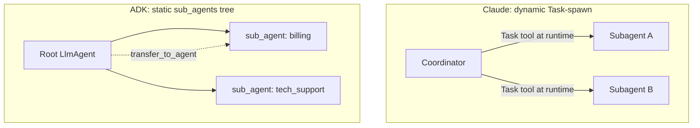

# Anatomy of a Claude Agent: Definition, Delegation, and Workflows

> DRAFT / working notes. Angle: builder-level anatomy — the actual objects and mechanics, not another "which framework wins" feature table. Refine later.

Most "Claude Agent SDK vs Google ADK" posts stop at philosophy and feature tables (loop vs graph, local vs cloud, model-agnostic or not). That ground is covered. What nobody puts side by side: the actual agent objects in code, how delegation really works under the hood, and the two distinct ways multi-agent work gets orchestrated. This post is that deeper cut.

<!-- more -->

## Why this angle is open

A web scan (June 2026) shows the head term is saturated: Composio, Silverthread, TURION.AI, jsmanifest, HolySheep, Morphllm all publish the same three-way 2026 comparison. They all answer "which do I pick". None answer "show me the agent object, the delegation mechanics, and the orchestration models in code". That is the gap this post fills.

(My existing high-level [Claude Agent SDK vs Google ADK](https://prabha.ai/writing/2025/12/21/claude-agent-sdk-vs-google-adk/) post already ranks for the head term, so this is the complementary deep-dive, not a rewrite.)

## The agent object

### Claude `AgentDefinition`

```python
agent = AgentDefinition(
    name="customer_support",
    description="Handles customer requests for returns and order issues",
    system_prompt="You are a customer support agent...",
    allowed_tools=["get_customer", "lookup_order", "process_refund", "escalate_to_human"],
)
```

### Google ADK `LlmAgent`

```python
from google.adk.agents import LlmAgent

agent = LlmAgent(
    name="customer_support",
    model="gemini-2.5-flash",                          # bound per-agent
    description="Handles returns and order issues",     # drives delegation routing
    instruction="You are a customer support agent...",
    tools=[get_customer, lookup_order, process_refund], # real callables
    sub_agents=[escalation_agent],                       # explicit child tree
)
```

Same DNA: a declarative object holding name + instruction + tools + description. Then they diverge.

## Field mapping

| Claude `AgentDefinition` | Google ADK `LlmAgent` | Same? |
|---|---|---|
| `name` | `name` | Identical role |
| `description` | `description` | Different use: ADK's drives delegation routing (a parent agent reads it to decide transfer); Claude's is a purpose statement |
| `system_prompt` | `instruction` | Same thing |
| `allowed_tools` (string allow-list) | `tools` (actual callables) | Different model (see below) |
| `model` (optional, defaults to inherit) | `model` (required per agent) | Both per-agent; differ on default |
| spawn via `"Task"` tool | `sub_agents=[...]` tree | Different delegation |

## The differences that actually matter

### 1. Tool binding philosophy

- **Claude**: `allowed_tools` is an allow-list of names. Capability gating, least privilege. Tools are registered elsewhere; the agent is just granted permission. Security-first framing.
- **ADK**: `tools=[...]` injects the actual callables. Dependency-injection framing. Same net effect (an unlisted tool is invisible), different mental model.

### 2. Model binding

- **ADK**: model is per-agent and required. Every agent must name its model.
- **Claude**: `AgentDefinition` has an optional `model` field. Omit it (or use `"inherit"`) and the subagent inherits the coordinator's model; set `"sonnet"`/`"opus"`/`"haiku"` to override per subagent. Heterogeneous trees are supported on both sides; the real difference is the default — ADK requires a model per agent, Claude defaults to inherit.

### 3. Delegation model (biggest difference)

- **Claude**: dynamic spawn. A coordinator gets `"Task"` in its `allowed_tools` and spawns subagents at runtime. Orchestrator-worker; the LLM decides when to fan out. The tree is not fixed up front.
- **ADK**: explicit `sub_agents` hierarchy declared at construction. Two delegation flavors: LLM-driven transfer (`transfer_to_agent`, which reads the child's `description`) and `AgentTool` (wrap an agent as a callable tool). The tree is mostly static; traversal is dynamic.



## Delegation is tool use under the hood

The thing that makes the Claude side click: **spawning an agent and calling a tool are the same operation.**

`Task` is a built-in tool (the SDK ships it; you don't implement it). The coordinator must have `"Task"` in its `allowed_tools` or it physically cannot delegate. When it delegates, the model fills three fields: `description` (a cosmetic label), `prompt` (the subagent's *entire* input/context), and `subagent_type` (the key in the `agents={...}` registry). The SDK resolves `subagent_type` to the registered `AgentDefinition`, builds a fresh isolated subagent, runs its own loop to `end_turn`, and returns **only the final text** as a `tool_result`. Multiple `Task` calls in one turn run concurrently — that's the fan-out.

Because delegation *is* tool use, the return value follows tool-result mechanics. The subagent's final `end_turn` message (role `assistant` in its own history) gets **converted into a `tool_result` block inside a `user`-role message** in the coordinator's history (tool results always ride in user-role messages; the Messages API only has user/assistant roles). In the managed SDK this conversion is automatic; in a hand-written raw-Messages-API loop, wiring it is *your* job — append the worker's text as a `tool_result` with a matching `tool_use_id`, or you get a 400 / broken context.

### Hub-and-spoke communication

All communication flows through the coordinator (the hub); spokes never talk to each other. Subagents do **not** inherit conversation history and do **not** share memory across calls, so the coordinator must pack *all* context into each `Task` prompt. Context isolation cuts both ways: clean and parallel-safe, but the coordinator must over-explain every spawn or the subagent flies blind.

## Declarative vs imperative (the underlying split)

Both `AgentDefinition` and `LlmAgent` are declarative: you describe *what* the agent is (name, prompt, tools), and the framework owns the *how* (the run loop). The imperative alternative is writing the loop by hand.

```python
# Imperative: you write every step (the "how")
messages = [{"role": "user", "content": "..."}]
for i in range(MAX_ITERS):                 # circuit breaker, not completion logic
    resp = client.messages.create(
        model="claude-opus-4-8",
        max_tokens=16000,
        thinking={"type": "adaptive"},
        tools=tools,
        messages=messages,
    )
    messages.append({"role": "assistant", "content": resp.content})
    if resp.stop_reason == "end_turn":
        break
    if resp.stop_reason == "tool_use":
        messages.append({"role": "user", "content": run_tools(resp.content)})
        continue
```

Declarative config sits on top; an imperative engine runs underneath. That is true in both frameworks.

### Sidebar: loop control and stop conditions

The primary completion signal is `stop_reason == "end_turn"`, not a text scan and not an iteration count. A max-iteration cap is **not** an anti-pattern when used as a safety backstop (circuit breaker) — only when used as the completion check. Production loops want both layers, plus ideally a token budget and loop detection.

Current `stop_reason` values to branch on (more than the four most guides list): `end_turn` (done), `tool_use` (continue), `max_tokens` (truncated), `stop_sequence`, `refusal` (safety; carries `stop_details`), `pause_turn` (resume server-tool work), `model_context_window_exceeded` (context window, distinct from `max_tokens`).

## Where tools execute (and what about secrets?)

The model **never** executes a tool. The API response `tool_use` is just a JSON request (`{name, input}`). For a custom client-side tool, the SDK's tool runner executes the function **in your own process**, with full access to your env vars, secrets, and DB connections. Secrets never leave your environment.

What *does* cross the wire to Anthropic: the tool name + description + input schema, the model-generated input args, and whatever you **return** as `tool_result`. Two consequences:

1. Never put secrets in the tool description/schema or in the returned result — the result crosses the wire.
2. The input args are model-generated, so treat them as untrusted input (validate, parameterize, no SQL injection).

The trust boundary is the wire: schemas, args, and return values cross; code and env do not. The model proposes; your runtime disposes.

## Workflows: two types — agents vs. code

> **PLACEHOLDER — expand later.** Core idea drafted; needs runnable examples + the Claude Code `/workflows` angle.

"Multi-agent" says *what*, not *how*. There are two ways to orchestrate the agents, split by **who controls the orchestration**:

| | **Model-driven (agents)** | **Code-driven (workflows)** |
|---|---|---|
| Who plans | The LLM, at runtime | A script, written in advance |
| Where the plan lives | The coordinator's reasoning | Actual code (`parallel()`, `pipeline()`, loops) |
| Determinism | Improvised; varies per run | Fixed structure; repeatable |
| Parallelism | Conversational, a few at a time | True fan-out (16+ at once) |
| Best for | Open-ended, shape-unknown tasks | Known shape: audit N files, migrate N sites |
| Analogy | A manager delegating ad-hoc | A factory assembly line |

- **Model-driven** is the `Task`-spawn / orchestrator-worker pattern above — the LLM decides what to spawn as it goes.
- **Code-driven** is a *workflow*: the coordination is a deterministic script (e.g. Claude Code's dynamic workflows, or ADK's `SequentialAgent` / `ParallelAgent` / `LoopAgent`). The plan is in code, so you get guaranteed parallelism, loop-until-done conditions, token budgets, and repeatability.

> TODO: add a concrete workflow script example (find → adversarially verify → synthesize). Tie to Claude Code `/workflows` + the `ultracode` keyword trigger. Cross-link to the prompt-chaining vs dynamic-decomposition split below.

### Prompt chaining vs dynamic decomposition

These two map onto the workflow split above. Both are LLM-in-a-loop on the same agentic substrate; the real difference is the **control locus** — who authors the decomposition and when:

- **Prompt chaining** = *you* author a fixed sequence/DAG at design time (the model fills each node, you own the edges); it may not even loop. This is the code-driven side.
- **Dynamic decomposition** = the *model* authors the graph at runtime (it decides subtasks mid-run, spawning subagents via `Task`); it *must* loop because the step count/shape is unknown up front. This is the model-driven side.

Not different architecture — different authorship. Chaining: you draw the flowchart, the LLM executes each box (deterministic, easy to debug). Dynamic: you hand the LLM the goal, it draws its own flowchart while running (varies per input, harder to debug). They're the two answers to "task too big for one call": chain when you can pre-plan the cut, go dynamic when the cuts only reveal themselves mid-investigation.

## TL;DR

Same DNA across frameworks, three axes of divergence:

- **Claude**: permission allow-list + dynamic `Task` spawn + optional per-agent model (defaults to inherit). Leans security and orchestrator-worker.
- **ADK**: inject real tools + static `sub_agent` tree + model-per-agent + built-in workflow agent types. Leans typed hierarchy and deterministic workflow primitives.

And one orchestration choice that cuts across both: **model-driven agents** (the LLM plans at runtime) vs **code-driven workflows** (the plan is a script). Pick by whether you know the shape of the work before you start.

## Sources / prior art to position against

- Composio: https://composio.dev/content/claude-agents-sdk-vs-openai-agents-sdk-vs-google-adk
- Silverthread Labs: https://www.silverthreadlabs.com/blog/ai-agent-sdks-compared
- TURION.AI: https://turion.ai/blog/google-adk-vs-openai-claude-agent-sdk-2026/
- jsmanifest: https://jsmanifest.com/claude-openai-google-agent-sdk-comparison
- ADK docs (Claude model): https://google.github.io/adk-docs/agents/models/anthropic/
- Claude Agent SDK overview: https://code.claude.com/docs/en/agent-sdk/overview
- Claude Code workflows: https://code.claude.com/docs/en/workflows
- My high-level post: https://prabha.ai/writing/2025/12/21/claude-agent-sdk-vs-google-adk/

## TODO before publish

- Flesh out the **Workflows: two types** placeholder with a runnable workflow script + Claude Code `/workflows` walkthrough
- Verify ADK field names against current ADK docs (API renames fast)
- Verify `AgentDefinition` field names against current Claude Agent SDK docs
- Add a concrete end-to-end runnable example for each side (definition → delegation → result)
- Decide final title and whether to split the workflows section into its own post
