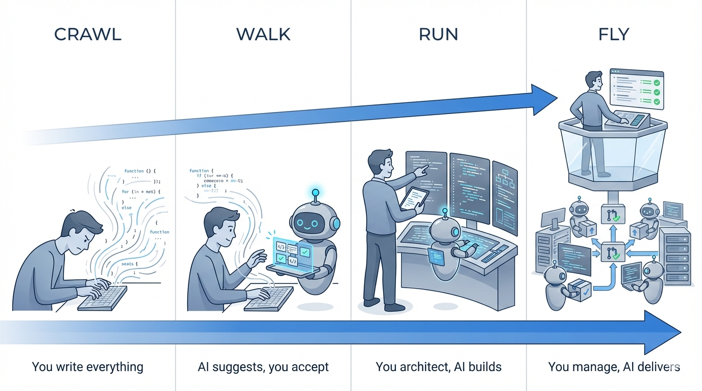

# The Evolution of AI-Assisted Development: From Developer to Manager

*Last Updated: December 2025*

The developer's relationship with code is fundamentally changing. As AI becomes more capable, the developer's role transforms with it. This isn't about better tools; it's about a shift in what developers actually *do*.

---

## The Baseline: The Developer

Before AI entered the picture, developers wrote every line of code. The IDE offered syntax highlighting and basic autocomplete, but these were rule-based, not learned. The code came from your fingers, your knowledge, your reasoning.

**The Developer:** You owned the code completely. Problem decomposition, algorithmic thinking, debugging through logical reasoning. Every line was intentional. Every bug was yours to find and fix.

**The AI:** None.

This was slow, mentally taxing, but you understood everything you shipped.

---

## AI Learned to Predict, and Developers Got Faster

AI began recognizing patterns in code. It could predict the next few characters, the next line, sometimes a whole block. Tab-tab-tab through boilerplate.

**The Developer:** You still wrote the code. AI just made your fingers faster. But now you needed a new skill: spotting when a suggestion was subtly wrong. You had to maintain your mental model while accepting code you didn't type.

**The AI:** Finishes your sentences. Suggests what comes next based on patterns it has seen.

Speed increased, but something shifted. You started accepting code without fully reading it. You stopped memorizing syntax; why bother when Tab provides it?

---

## AI Learned Intent, and Developers Became Architects

Language models grew larger. AI could now understand what you meant, not just what you typed. "Write a function that validates email addresses" became reality in seconds. You could describe the *what* and AI would handle the *how*.

**The Developer:** You became an architect. You directed the work, specified at the function level, and wove individual outputs into a coherent system. AI was your hands; you remained the brain. You still reviewed each piece, still understood the code you shipped, even if you didn't type it.

**The AI:** Takes instructions and builds functions or code blocks. Explains unfamiliar code. Answers questions about your codebase.

Productivity exploded. But a new risk emerged: "vibe coding," accepting code that works without understanding why. The gap between what you could do with AI and without AI widened.

Geoffrey Litt calls this the [surgeon model](https://www.geoffreylitt.com/2025/10/24/code-like-a-surgeon): stay hands-on for primary work, delegate secondary tasks to AI. You're not managing AI; you're operating with AI support.

---

## AI Executes Autonomously, and Developers Become Managers (Emerging)

AI is learning to reason, plan, and execute multi-step tasks without hand-holding. Assign a bug, and the agent investigates, edits files, runs tests, and opens a pull request. You review the deliverable, not the process.

**The Developer:** You become a manager. You assign work, define outcomes, set acceptance criteria. You orchestrate multiple workstreams toward the product goal. The code is no longer yours; the outcome is. You review at the deliverable level, not line-by-line.

**The AI:** Works independently on assigned tasks. Plans, codes, tests, and delivers.

This phase is emerging, not arrived. Google just released [Antigravity](https://antigravity.google) last week. Claude Code, Cursor, and GitHub Copilot all have agentic capabilities now. These tools are promising for prototypes and personal projects, but not yet enterprise production ready. Trust takes time to build.

And let's be honest: even the smartest models make basic mistakes. Building a production system with just prompting remains far-fetched. Code written entirely by AI tends to be bloated, unoptimized, and hard to maintain.

As @catalinmpit put it: "Vibe coding is easy. Vibe debugging is the hard part."

---

## The Transformation Continues

Each shift follows the same pattern: AI becomes capable of something new, and the developer's role moves up a level of abstraction.

- **Autocomplete:** AI predicts tokens → Developer still writes, but faster
- **Copilot/Chat:** AI understands intent → Developer directs, AI executes
- **Agents:** AI reasons autonomously → Developer manages, AI delivers

The constant is change. The role keeps shifting. What worked yesterday may not be enough tomorrow.

The question isn't which phase is "best." It's recognizing where you are, understanding where things are heading, and adapting as the transformation continues.
