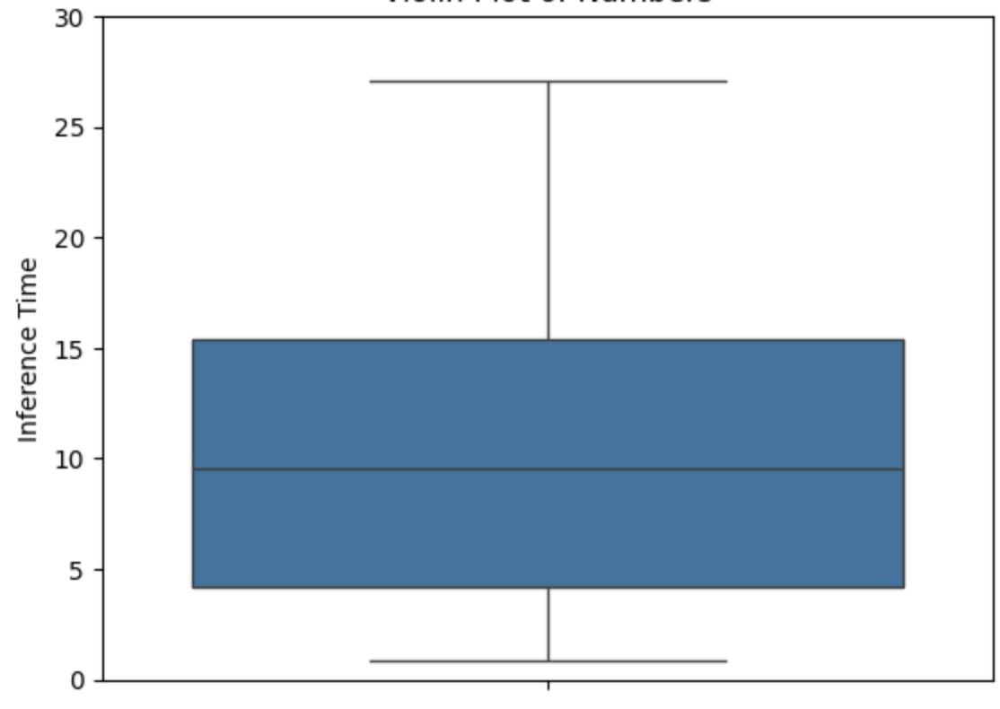
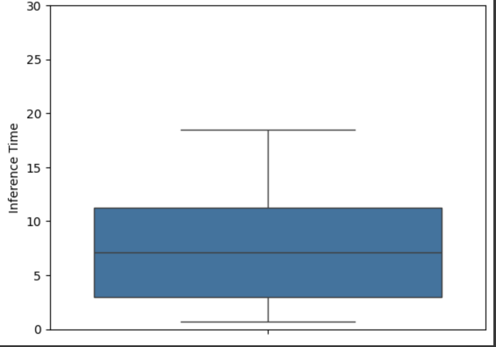

# Quantized LLM Models

Large Language Models (LLMs) are known for their vast number of parameters, often reaching billions. For example, open-source models like Llama2 come in sizes of 7B, 13B, and 70B parameters, while Google's Gemma has 2B parameters. Although OpenAI's GPT-4 architecture is not publicly shared, it is speculated to have more than a trillion parameters, with 8 models working together in a mixture of experts approach.

## Understanding Parameters

A parameter is a model weight learned during the training phase. The number of parameters can be a rough indicator of a model's capability and complexity. These parameters are used in huge matrix multiplications across each layer until an output is produced.

### The Problem with Large Number of Parameters

As LLMs have billions of parameters, loading all the parameters into memory and performing massive matrix multiplications becomes a challenge. Let's consider the math behind this:

For a 70B parameter model (like the Llama2-70B model), the default size in which these parameters are stored is 32 bits (4 bytes). To load this model, you would need:

70B parameters * 4 bytes = 260 GB of memory

This highlights the significant memory requirements for running LLMs.

## Quantization as a Solution

Quantization is a technique used to reduce the size of the model by decreasing the precision of parameters and storing them in less memory. For example, representing 32-bit floating-point (FP32) parameters in a 16-bit floating-point (FP16) datatype.

In practice, this loss of precision does not significantly degrade the output quality of LLMs but offers substantial performance improvements in terms of efficiency. By quantizing the model, the memory footprint can be reduced, making it more feasible to run LLMs on resource-constrained systems.

Quantization allows for a trade-off between model size and performance, enabling the deployment of LLMs in a wider range of applications and devices. It is an essential technique for making LLMs more accessible and efficient while maintaining their impressive capabilities.

The table below compares the performance of Google’s 2B Gemma model with 32-bit and 16-bit precision. The quantized 16-bit model is 28% faster with approximately 50% less memory usage.

|                                   | Gemma FP 32 bit precision                | Gemma FP16 bit precision                 |
| --------------------------------- | ---------------------------------------- | ---------------------------------------- |
| # of Parameters                   | 2,506,172,416                            | 2,506,172,416                            |
| Memory Size based on # Parameters | > 2.5B * 4 Bytes 9.33 GB              | > 2.5B * 2 Bytes 4.66 GB              |
| Memory Footprint                  | 9.39 GB                                  | 4.73 GB                                  |
| Average Inference time            | 10.36 seconds                            | 7.48 seconds                             |
| Distribution of Inference Time    |  |  |

## Impact on Accuracy

To assess the impact of quantization on accuracy, I ran the output of both models and computed the similarity score using OpenAI's `text-embedding-3-large` model. The results showed that the similarity scores between the outputs of the 32-bit and 16-bit models were highly comparable with 0.998 cosine similarity, indicating that quantization does not significantly affect the model's accuracy.

In conclusion, quantization is a powerful technique for reducing the memory footprint and improving the efficiency of LLMs while maintaining their performance. By enabling the deployment of LLMs on a wider range of devices and applications, quantization plays a crucial role in making these impressive models more accessible and practical for real-world use cases.

_Note: Inference time and Accuracy are measured for 100 random question, you can find them in the [colab notebook](https://colab.research.google.com/drive/1eR3h_aV1CXUdG9Yzl29o3VR9Yr6J65JG?usp=sharing)_

 If you have any feedback or simply want to connect, please hit me up on [LinkedIn](https://www.linkedin.com/in/prabha-arivalagan/) or [@prabha-tweet](https://twitter.com/prabhatweet)
